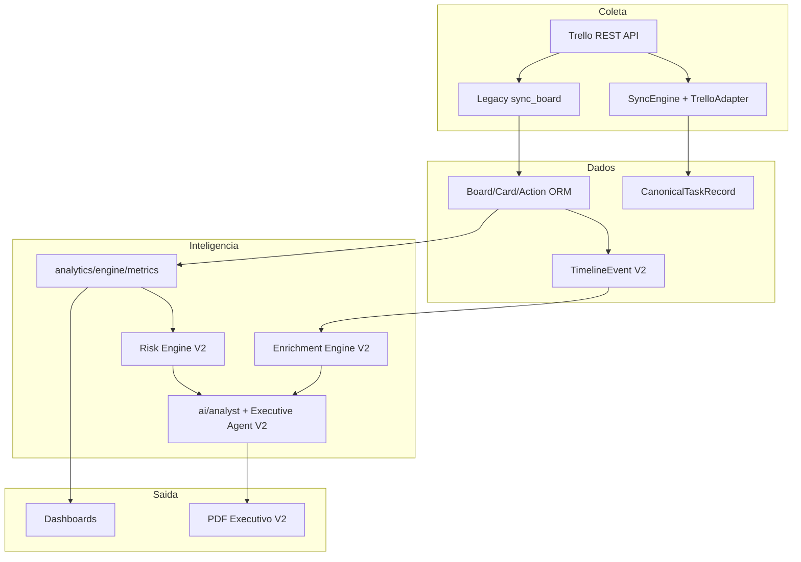

# Auditoria EOR Intelligence Engine V2

**Data:** 2026-06-20  
**Escopo:** Backend, frontend, banco de dados, APIs Trello, jobs, workers, IA, relatórios  
**Objetivo:** Mapear estado atual e fundamentar evolução para plataforma de Inteligência Operacional baseada em eventos.

---

## 1. Resumo Executivo

O projeto EOP (TIP — Trello Intelligence Platform) possui **duas arquiteturas paralelas**:

| Camada | Escopo | Maturidade |
|--------|--------|------------|
| **Legacy** | ORM Trello rico + analytics + IA OpenAI + PDF | Produção parcial |
| **Platform (`apps/`)** | Integrações multi-provider + tasks canônicas | MVP em evolução |

A evolução V2 deve **unificar a inteligência sobre eventos rastreáveis**, reutilizando o motor de métricas legacy e a infraestrutura de integração platform, sem duplicar lógica de negócio.

---

## 2. Componentes Existentes

### 2.1 Backend — Apps Django

| App | Path | Responsabilidade |
|-----|------|------------------|
| `core` | `core/` | `TimeStampedModel`, health check |
| `integrations.trello` | `integrations/trello/` | Sync completo Trello → PostgreSQL com event sourcing |
| `analytics` | `analytics/` | KPIs Kanban (lead/cycle time, throughput, aging, gaps) |
| `dashboard` | `dashboard/` | Payloads executivos a partir de métricas |
| `reports` | `reports/` | PDF executivo (ReportLab) + diagnóstico IA |
| `ai` | `ai/` | Diagnóstico operacional OpenAI |
| `apps.integrations` | `apps/integrations/` | Engine de sync, adapters, fila, workers |
| `apps.dashboards` | `apps/dashboards/` | Dashboards a partir de `CanonicalTaskRecord` |
| `apps.reports` | `apps/reports/` | PDF canônico (diagnóstico rule-based) |
| `apps.settings` | `apps/settings/` | Workspace, Trello, OpenAI |
| `apps.users` | `apps/users/` | Auth demo / RBAC placeholder |

### 2.2 Banco de Dados — Modelos Concretos

**Legacy Trello ORM** (`integrations/trello/models.py`):

- `Board`, `BoardList`, `Member`, `Card`
- `Action` — log imutável de eventos Trello
- `CardStatusHistory` — transições de status append-only
- `EntityHistory` — revisões de entidades (event sourcing simples)
- `Snapshot` — captura diária point-in-time

**Platform** (`apps/integrations/models.py`):

- `IntegrationConnection` — credenciais criptografadas por provider
- `CanonicalTaskRecord` — task unificada cross-provider
- `IntegrationState` — cursor de sync incremental
- `IngestionQueueEvent` — fila persistida para processamento async

**Settings** (`apps/settings/models.py`):

- `WorkspaceConfig` — singleton com OpenAI key/model

**Gaps identificados:** `ai/models.py`, `analytics/models.py`, `reports/models.py` — stubs vazios, sem persistência de inteligência.

### 2.3 APIs Trello — Dois Pipelines

| Pipeline | Client | Captura actions? | Uso |
|----------|--------|------------------|-----|
| Legacy | `integrations/trello/client.py` | **Sim** | Analytics rico, IA, PDF legacy |
| Platform | `apps/integrations/trello/client.py` | **Não** | Sync canônico, dashboards simplificados |

**Endpoints de sync:**

- `POST /api/integrations/trello/sync/<board_id>/` — legacy full sync
- `POST /api/v1/integrations/trello/connections/<id>/sync/` — platform SyncEngine
- `POST /api/v1/data-sources/trello/sync/` — facade data-sources

### 2.4 Jobs / Workers / Celery

| Componente | Status |
|------------|--------|
| Celery app | Configurado (`tip_backend/celery.py`) |
| `dispatch_integration_event` | Implementado |
| `run_trello_worker_task` | Implementado |
| `TrelloWorker` | Upsert canonical + cache refresh |
| `IngestionEngine` | **Implementado mas não wired em views** |
| Celery Beat (sync periódico) | **Ausente** |
| Bridge legacy sync → platform | **Ausente** |

Backends de fila: `local_db` (default), `local_sync`, `local_background`, `celery`, `kafka` (stub).

### 2.5 Serviços de IA

| Arquivo | Função |
|---------|--------|
| `ai/analyst.py` | `analyze_metrics()` — diagnóstico JSON via OpenAI |
| `ai/openai_models.py` | Catálogo e validação de modelos |
| `ai/views.py` | `POST /api/ai/analyze/` |

**Limitações:**

- OpenAI config em `WorkspaceConfig` **não consumida** por `analyze_metrics()` (usa env)
- Sem persistência de diagnósticos
- Sem agente executivo estruturado (V2 adiciona `ExecutiveSummaryAgent`)

### 2.6 Geradores de Relatório

| Path | Fonte de dados | Diagnóstico |
|------|----------------|-------------|
| `POST /api/reports/executive/` | Legacy ORM | OpenAI |
| `POST /api/v1/reports/executive/` | CanonicalTaskRecord | Rule-based |

Engine PDF: `reports/engine/pdf_builder.py`, `reports/engine/charts.py`

### 2.7 Frontend

| Feature | Path | Status |
|---------|------|--------|
| Dashboard operacional | `frontend/src/features/dashboards/` | Ativo (métricas canônicas) |
| Analytics | `frontend/src/features/analytics/` | Ativo (UI mínima) |
| Reports | `frontend/src/features/reports/` | Download PDF |
| Settings | `frontend/src/features/settings/` | Workspace, Trello, OpenAI |
| Integrations | `frontend/src/features/integrations/` | Connect/sync Trello |
| AI Insights | — | **Ausente** (perm. definida, sem rota) |
| Dashboard executivo | — | **Ausente** |
| Métricas legacy | `frontend/lib/`, `frontend/components/` | **Orfãs** |

---

## 3. Pontos de Integração



**Hooks recomendados (implementados na V2):**

1. Pós-sync legacy → `build_timeline_events_for_board()`
2. `sync_completed` signal → pipeline de inteligência
3. `load_board_records()` → entrada unificada para KPI/Risk/Predictive

---

## 4. Riscos Técnicos

| Risco | Severidade | Mitigação V2 |
|-------|------------|--------------|
| Dual architecture / dados divergentes | **Alta** | `WorkManagementProvider` + timeline sobre legacy ORM |
| Platform sync sem actions | **Alta** | Timeline depende de legacy sync; documentar requisito |
| Auth inexistente | **Alta** | Manter escopo V2; auth real na V3 |
| OpenAI config desconectada | **Média** | Executive agent aceita override; wiring settings na V3 |
| IngestionEngine não wired | **Média** | Pipeline sync → timeline síncrono na V2 |
| Cobertura de testes fragmentada | **Média** | Suite `apps/intelligence/tests/` ≥80% |
| Frontend desconectado de IA | **Média** | API V2 exposta; UI executiva na V3 |

---

## 5. Dívidas Técnicas

1. **Dois clientes Trello** com capacidades diferentes
2. **Endpoints duplicados** (`/api/*` vs `/api/v1/*`)
3. **Diagnóstico inconsistente** (OpenAI vs rule-based)
4. **Modelos vazios** em ai/analytics/reports
5. **Jira/ClickUp** registrados mas não implementados
6. **Token de sessão** não enviado pelo frontend
7. **Mocks ricos** (`portal.ts`) não integrados
8. **Sem sync automático** (beat/cron)

---

## 6. Oportunidades de Reutilização

| Componente | Reuso na V2 |
|------------|-------------|
| `analytics/engine/metrics.py` | KPI Engine (lead time, cycle time, throughput, WIP, etc.) |
| `analytics/adapters.py` | Carregamento CardRecord/ActionRecord |
| `analytics/services/builders.py` | Composição de payloads API |
| `ai/analyst.py` | Base para Executive Summary Agent |
| `ai/openai_models.py` | Validação de modelos |
| `reports/engine/pdf_builder.py` | Relatório executivo V2 (extensão) |
| `apps/integrations/core/*` | WorkManagementProvider pattern |
| `integrations/trello/models.Action` | Fonte para TimelineEvent |
| `CardStatusHistory` | Validação cruzada de movimentações |
| `dashboard/services/builders.py` | Health score → Operational Score |

---

## 7. Mapa de Arquivos-Chave

```
integrations/trello/
  models.py              # Entidades operacionais legacy
  services/sync.py       # Coleta + event sourcing
  client.py              # API Trello (actions incluídas)

analytics/
  adapters.py            # ORM → CardRecord/ActionRecord
  engine/metrics.py      # KPIs provider-agnostic
  services/builders.py   # Agregações API

ai/
  analyst.py             # Diagnóstico OpenAI

reports/engine/
  pdf_builder.py         # PDF executivo

apps/integrations/
  core/engine.py         # SyncEngine
  core/adapter.py        # BaseIntegrationAdapter
  trello/adapter.py      # TrelloAdapter

apps/intelligence/       # NOVO — EOR V2
  models.py              # TimelineEvent, CardEnrichment, KnowledgeBase
  services/              # Engines de inteligência
  providers/             # WorkManagementProvider

frontend/src/features/   # UI operacional (executivo na V3)
```

---

## 8. Recomendações para V2

1. **Camada de domínio** com `TimelineEvent` como histórico consolidado
2. **Pipeline pós-sync**: normalização → enriquecimento → analytics → IA → insights
3. **Provider-agnostic intelligence** via `WorkManagementProvider`
4. **Persistir outputs** (enrichment, scores, knowledge base)
5. **API `/api/v1/intelligence/`** para consumo frontend
6. **Relatório executivo V2** com 14 seções estruturadas
7. **Manter legacy APIs** durante transição (compatibilidade)

---

## 9. Conclusão

O MVP possui **fundação sólida** em coleta legacy (actions + history), métricas Kanban e IA diagnóstica. A V2 transforma essa base em **pipeline de inteligência orientado a eventos**, adicionando enriquecimento, timeline, risco, predição e score operacional proprietário, preparando integrações futuras sem acoplar à origem Trello.

**Próximo passo:** Implementação em `apps/intelligence/` conforme etapas 2–16 do plano V2.
