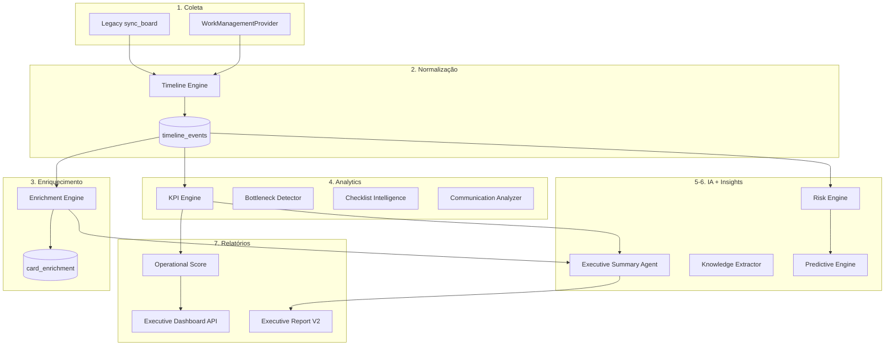

# EOR Intelligence Engine V2 — Architecture

## Overview

The V2 intelligence layer transforms Trello operational data into managerial intelligence through a 7-stage pipeline:

```
Coleta → Normalização → Enriquecimento → Analytics → IA → Insights → Relatórios
```

## Component Diagram



## Django App: `apps/intelligence`

| Module | Path | Responsibility |
|--------|------|----------------|
| Models | `models.py` | TimelineEvent, CardEnrichment, KnowledgeBaseEntry, OperationalScoreSnapshot |
| Domain | `domain/` | Event types, entity dataclasses |
| Timeline | `services/timeline/` | Action → TimelineEvent mapping |
| Enrichment | `services/enrichment/` | Executive context extraction |
| Communication | `services/communication_analysis/` | Comment analysis |
| Checklist | `services/checklist/` | Execution scoring |
| KPI | `services/kpi/` | Extended KPI suite (wraps analytics) |
| Bottleneck | `services/bottleneck_detector/` | Congestion detection |
| Risk | `services/risk_engine/` | 0-100 risk scoring |
| Predictive | `services/predictive/` | Delay/block probability |
| Knowledge | `services/knowledge/` | Auto knowledge base |
| Executive | `services/executive_summary/` | AI + rule-based summary |
| Score | `services/operational_score/` | EOR Operational Score |
| Report | `services/report_builder.py` | 14-section report |
| Dashboard | `services/dashboard/` | Multi-level dashboards |
| Orchestrator | `services/orchestrator.py` | Full pipeline |
| Providers | `providers/` | WorkManagementProvider interface |

## API Endpoints

Base: `/api/v1/intelligence/`

| Method | Path | Description |
|--------|------|-------------|
| GET | `/` | Module overview |
| POST | `/pipeline/` | Run full intelligence pipeline |
| GET | `/timeline/` | Build/view timeline |
| GET | `/kpis/` | Full KPI suite |
| GET | `/bottlenecks/` | Bottleneck detection |
| GET | `/risks/` | Risk assessments |
| GET | `/predictions/` | Predictive analysis |
| GET | `/score/` | Operational score |
| GET | `/executive-summary/` | Executive summary |
| GET | `/report/` | 14-section report |
| GET | `/knowledge/` | Knowledge base |
| POST | `/enrichment/` | Run enrichment |
| GET | `/dashboard/?level=operational\|management\|director\|ceo` | Executive dashboards |

## Data Model

### timeline_events

| Field | Type | Description |
|-------|------|-------------|
| id | PK | Auto |
| board_id | FK | Board reference |
| card_id | FK | Card reference (nullable) |
| event_type | enum | CARD_CREATED, CARD_MOVED, etc. |
| event_timestamp | datetime | When event occurred |
| actor | string | Who performed the action |
| payload_json | JSON | Event details |
| created_at | datetime | Record creation |

## Provider Abstraction

```python
class WorkManagementProvider(ABC):
    provider: ClassVar[str]
    def authenticate(credentials) -> None
    def list_boards() -> list[ProviderBoard]
    def fetch_cards(board_id) -> list[ProviderCard]
    def fetch_events(board_id, since) -> list[ProviderEvent]
```

Registered providers: `trello` (implemented). Future: Jira, ClickUp, Asana, Monday, Notion, Planner.

## Integration Points

- **Post-sync hook:** `integrations/trello/services/sync.py` calls `build_timeline_events_for_board()`
- **Reuses:** `analytics/engine/metrics.py`, `ai/analyst.py`, `analytics/adapters.py`

## Dependencies

- Requires legacy Trello sync (with actions) for full intelligence
- OpenAI optional for AI-enhanced summaries (`use_ai=true`)
